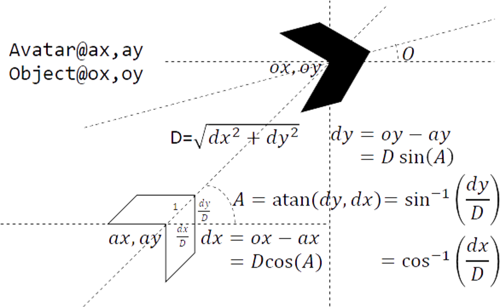

# Summary

Arcade Simplex is a an open-source codebase for learning-by-example how to create 3d video games. The target users are teachers of digital media classes or introductory programming classes, who want to incorporate a game programming module into their lesson plans. 

This is teaching code. The goal is not _efficient_ code, per se, but _easy-to-understand_ code. All game pieces are based on simple polygons, but it is easy to replace them with more sophisticated models. The use of polygons, however, allows game programmers to focus on learning the basics of the code, rather than being distracted by 3d modeling & animation code. 

The master branch contains the base code.  Each branch is a variation that builds functionality on top of the base code. 

There are 9 branches:

1. ArcadeSimplexBase -- this is always merged into the master, and contains bug fixes to the main code
2. VFollowCam -- a follow-behind and follow--top camera
3. VObstacles -- block obstacles, which stop monsters, bullets, and the hero
4. VMonstersFiring -- monsters firing when the hero gets too close
5. VPowerPellets -- the picking up of pellets before firing
6. VThreeMissiles -- firing three missiles at once
7. VSplitHitMissiles -- monsters exploding into richocheting missiles
8. VNormalExplosion -- monsters exploding before when hit
9. VInfiniteMonsters -- after clearing a level, the number of monsters doubles; this continues until the player dies 

`ArcadeSimplex` was used as the codebase for two publications [@Flor:2017a; @Flor:2017b] and @Flor:2015.

# Statement of need

Learning computer programming is notoriously difficult but a motivated student will usually succeed despite bad conditions in the teaching or in the tools that constitute the learning environment [@Brito:2014].

One way to motivate students is to have them apply the material to solve problems they are interested in, rather than the typical abstract problems given to introductory programming student, e.g., the rainfall problem [@Johnson:1985].

# Teaching Application

In the Fall of 2017, as part of the Freshmen Learning Communities program at the University of New Mexico, I taught a class on Internet Memes & Digital Media in the business school (MGMT190, “Memes Class”). Memes class was paired with Computer Programming Fundamentals in the engineering school (CS151L, “Programming Class”). Both classes contained incoming freshmen only.

In paired classes, students apply the concepts from one class to another class. In this case, they apply programming  concepts to the development of memes. The hope is that students will acquire a deeper understanding of programming by applying what they learn to create memes.  

The first week of class, I asked students how they would like to apply the programming skills they learned towards creading memes. Now, there are many different kinds of memes, the most popular of which are image macros and funny/shocking videos. But a majority of the students indicated they would like to try something different—to create memes based on simple video games. 

The main issue was that these students were introductory programming students and did not have the programming skills necessary to create games from scratch. They were adept, however, at taking code and modifying it. 

Thus, I created `ArcadeSimplex` a codebase to help students — with neither programming nor game development experience — to develop video game memes using a copy and tweak strategy. 

# Math

Arcade Simplex uses only basic trigonometry, which the following diagram summarizes:

_Distance Formula_

Given a player avatar at $ax, ay$ and an object (e.g., a monster) at $ox, oy$, the distance, $D$, between them is determined by first calculating the deltas, $dx=ox-ax$, and
$dy=oy-ay$, and then using the distance formula: 
$D=\sqrt{dx^2+dy^2}$.

Arcade Simplex uses the distance formula to determine collisions between missiles and monsters, and between monsters and players.

_Orientation Formula_

To calculate the angle of orientation, $A, first calculating the deltas, $dx=ox-ax$, and
$dy=oy-ay$, and then using the orientation formula: $A=\arctan{dx^2+dy^2}$.

Arcade Simplex uses arctangent to determine how to orient objects to the player or vice versa.

_Alternative Formulas_
$dx=D\cos{A}$ 
$dy=D\sin{A}]$ 
$A=\arccos{\frac{dx}{D}}$ 
$A=\arcsin{\frac{dy}{D}}$

# Acknowledgements

This material is based partly upon work supported by the National Science Foundation (NSF)
under both ECCS - 1231046 and CMMI - 1635334. Any opinions, findings, and conclusions or 
recommendations expressed in this material are those of the author and do not necessarily
reflect the views of the NSF.

# References
